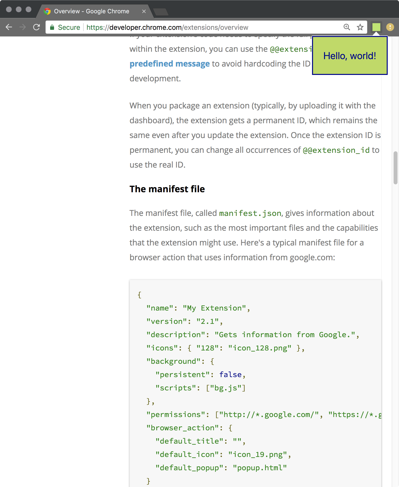

# introChromeExtension

An investigation into [Google Chrome Extensions](https://developer.chrome.com/extensions/getstarted), built on a [TypeScript & React]( skeleton.https://github.com/martellaj/chrome-extension-react-typescript-boilerplate) skeleton.



## Building

```
yarn install
yarn build
yarn watch
```

## Insalling 

1.  Build like above.
2.  Go to [_chrome://extensions_](chrome://extensions) in Google Chrome.
3.  With the developer mode checkbox ticked, click **Load unpacked extension...** and select the _dist_ folder from this repo
